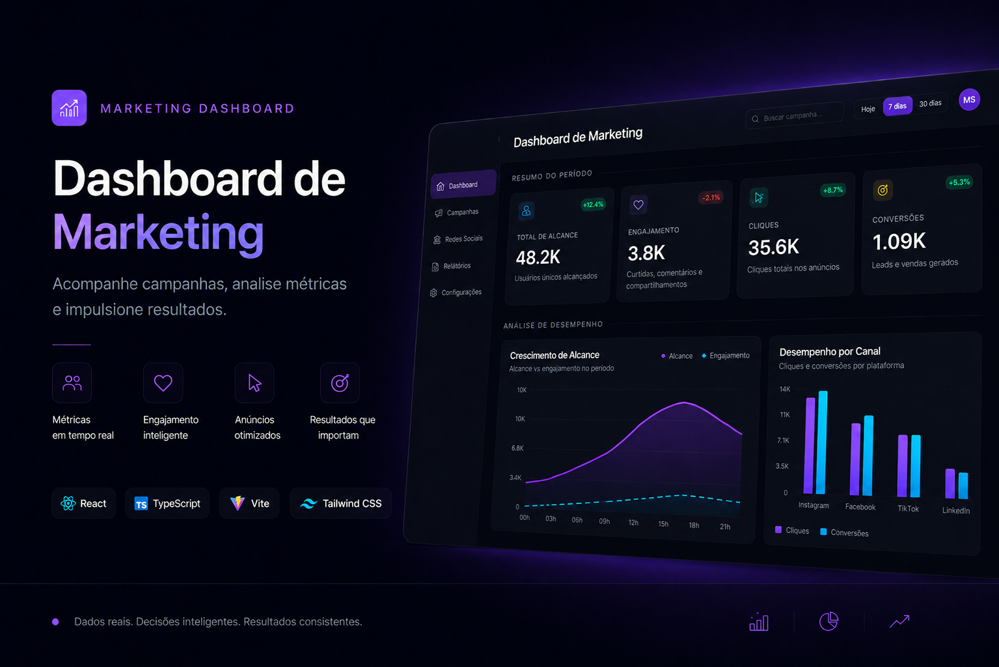

<p align="center">
  
</p>

<h1 align="center">Dashboard de Marketing</h1>

<p align="center">
  Plataforma analítica para acompanhamento de campanhas, métricas de alcance, engajamento, cliques e conversões — construída com stack moderna e interface dark premium.
</p>

<p align="center">
  <a href="https://dashboard-de-dados-reais.vercel.app" target="_blank">
    
  </a>
  
  
  
  
</p>

---

## 📌 Sobre o Projeto

O **Dashboard de Marketing** é uma aplicação front-end que simula um painel analítico completo para equipes de marketing digital. O projeto foi desenvolvido para portfólio profissional, demonstrando a capacidade de construir interfaces orientadas a dados com componentização, responsividade e boa organização de código.

Todos os dados são servidos via `public/db.json`, replicando o comportamento de uma API real. O resultado é uma experiência de usuário fiel a produtos SaaS de análise de campanhas.

> **Acesse o projeto em produção:** [dashboard-de-dados-reais.vercel.app](https://dashboard-de-dados-reais.vercel.app)

---

## 🖥️ Preview

<p align="center">
  
</p>

---

## ✨ Funcionalidades

- 📊 **Cards de métricas principais** — Alcance, Engajamento, Cliques e Conversões com indicadores de variação percentual
- 📈 **Gráfico de crescimento de alcance** — Visualização SVG customizada de alcance vs. engajamento por horário
- 📉 **Gráfico de desempenho por canal** — Barras comparativas de cliques e conversões por plataforma (Instagram, Facebook, TikTok, LinkedIn)
- 🔍 **Busca de campanhas** — Filtragem em tempo real por nome da campanha ou canal
- 📅 **Filtro por período** — Segmentação por Hoje, 7 dias ou 30 dias
- 🏷️ **Filtro por status** — Todos, Ativa, Pausada ou Finalizada com contadores dinâmicos
- 🗂️ **Tabela de campanhas** — Listagem responsiva com investimento, resultado e status visual
- 🧭 **Navegação lateral** — Sidebar fixa com scroll suave entre seções
- 📱 **Interface responsiva** — Layout adaptável para desktop, tablet e mobile

---

## 🛠️ Tecnologias Utilizadas

| Tecnologia | Versão | Papel no Projeto |
|---|---|---|
| **React** | 19 | Construção da interface com componentes funcionais e hooks (`useState`, `useEffect`, `useMemo`) |
| **TypeScript** | 6.0 | Tipagem estática completa — tipos para métricas, campanhas, canais e dados de desempenho |
| **Vite** | 8.0 | Servidor de desenvolvimento ultrarrápido com Hot Module Replacement (HMR) |
| **Tailwind CSS** | 4.0 | Estilização utilitária com paleta dark, bordas customizadas e responsividade declarativa |
| **ESLint** | 10.x | Análise estática e boas práticas com suporte a React Hooks e TypeScript |

---

## 📊 Métricas Exibidas

| Indicador | Valor | Variação | Descrição |
|---|---|---|---|
| 🟣 **Total de Alcance** | 48.2K | +12.4% | Usuários únicos alcançados |
| 🔵 **Engajamento** | 3.8K | -2.1% | Curtidas, comentários e compartilhamentos |
| 🟢 **Cliques** | 35.6K | +8.7% | Cliques totais nos anúncios |
| 🟡 **Conversões** | 1.09K | +5.3% | Leads e vendas gerados |

---

## 🚀 Como Executar o Projeto

**Pré-requisitos:** Node.js 18+ e npm instalados.

```bash
# Clone o repositório
git clone https://github.com/DevWizardMarcos/Dashboard-de-dados-reais.git

# Entre na pasta do projeto
cd Dashboard-de-dados-reais

# Instale as dependências
npm install

# Inicie o servidor de desenvolvimento
npm run dev
```

Acesse em: `http://localhost:5173`

**Outros scripts disponíveis:**

```bash
npm run build    # Build de produção (tsc + Vite)
npm run preview  # Preview local do build de produção
npm run lint     # Análise estática com ESLint
```

---

## 🗂️ Estrutura do Projeto

```
Dashboard-de-dados-reais/
├── public/
│   ├── db.json          # Dados simulados (métricas, campanhas, canais, desempenho)
│   ├── favicon.svg      # Ícone da aplicação
│   └── icons.svg        # Sprite de ícones SVG
├── src/
│   ├── assets/
│   │   ├── hero.png     # Imagem de preview da interface
│   │   ├── react.svg    # Logo React
│   │   └── vite.svg     # Logo Vite
│   ├── App.tsx          # Componente raiz — toda a lógica e UI do dashboard
│   ├── main.tsx         # Entry point da aplicação React
│   └── index.css        # Estilos globais e diretivas Tailwind
├── bannerRead/
│   └── BannerPrincipal.png  # Banner do README
├── index.html           # Template HTML do Vite
├── db.json              # Cópia dos dados para testes locais
├── package.json         # Dependências e scripts
├── vite.config.ts       # Configuração do Vite
├── tsconfig.json        # Configuração raiz do TypeScript
├── tsconfig.app.json    # Configuração do TypeScript para a aplicação
├── tsconfig.node.json   # Configuração do TypeScript para o Node
└── eslint.config.js     # Regras de linting
```

---

## 📚 Aprendizados e Demonstrações Técnicas

Este projeto evidencia as seguintes competências:

- **Componentização com React** — Componentes reutilizáveis como `Icon`, `SectionTitle` e `ScreenMessage` com props tipadas
- **Tipagem avançada com TypeScript** — Tipos customizados para toda a estrutura de dados (`Metric`, `Campaign`, `Channel`, `PerformancePoint`, `DashboardData`)
- **Gerenciamento de estado e efeitos** — Uso de `useState` para controle de filtros, `useEffect` para carregamento assíncrono de dados e `useMemo` para filtragem performática de campanhas
- **Renderização de gráficos com SVG puro** — Construção de linha path, área de preenchimento e gráfico de barras sem dependência de bibliotecas externas
- **Filtragem e busca em tempo real** — Lógica combinada de busca textual, filtro de período e status calculada com `useMemo`
- **Responsividade declarativa** — Layout adaptável com breakpoints do Tailwind (`md:`, `lg:`, `xl:`)
- **UI dark premium** — Paleta de cores coesa com tons violet, emerald, cyan e amber sobre fundo `#070b12`
- **Carregamento de dados simulado** — Fetch assíncrono de `public/db.json` replicando o comportamento de uma API REST

---

## 👤 Autor

| [<br><sub>DevWizardMarcos</sub>](https://github.com/DevWizardMarcos) |
| :---: |

### 📩 Contato

Se quiser saber mais sobre mim, entre em contato através do meu [LinkedIn](https://www.linkedin.com/in/marcos-simoes-ms/) ou visite meu.

<p>
  <a href="https://github.com/DevWizardMarcos">
    
  </a>
</p>

---

<p align="center">
  <sub>Feito com React, TypeScript e Tailwind CSS · 2025</sub>
</p>
